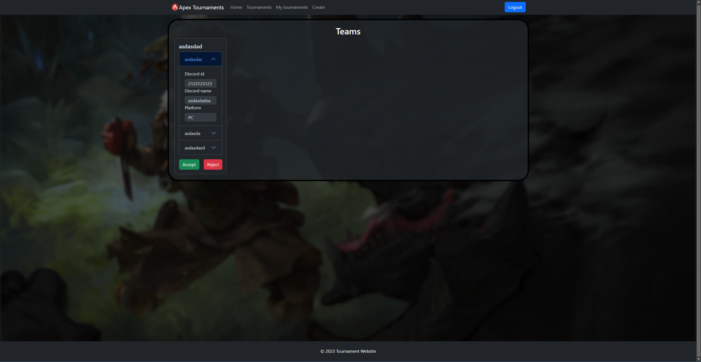

# Apex Legends Tournaments Frontend

Welcome to the frontend repository for the Apex Legends Tournaments website! This React.js project serves as the user interface for interacting with the tournaments organized through the [corresponding backend](https://github.com/shiro47/tournament_website_backend).

## Table of Contents
- [Introduction](#introduction)
- [Features](#features)
- [Getting Started](#getting-started)
  - [Prerequisites](#prerequisites)
  - [Installation](#installation)
- [Usage](#usage)
- [Screenshots](#screenshots)
- [License](#license)

## Introduction

This project provides a user-friendly interface for participants, organizers, and viewers to engage with Apex Legends tournaments. Leveraging React.js allows for an interactive and dynamic experience.

## Features

- **Tournament Exploration:** View a list of ongoing and upcoming tournaments.
- **Team Registration:** Register teams for participation in tournaments.
- **User Authentication:** Secure login for tournaments admins.
- **Responsive Design:** Ensures a seamless experience on various devices.

## Getting Started

### Prerequisites

Make sure you have the following installed:

- Node.js
- npm (Node Package Manager)

### Installation

1. Clone the repository:
   ```bash
   git clone https://github.com/shiro47/tournament_website-frontend.git
   ```
2. Navigate to the project directory:
    ```bash
   cd tournament_website-frontend
   ```
3. Install dependencies using npm:
    ```bash
   npm install
   ```

### Usage

1. Start the development server:
    ```bash
    npm start
    ```

The application will be accessible at http://localhost:3000/. Explore the frontend to interact with the tournaments and teams.

## Screenshots

### Client 

- Home Page

- Tournaments list

- Tournament Details

- Tournament Teams

- Tournament Register

- Login


### Admin
- My Tournaments

- Tournament Creator

- Accept Teams


## License
This project is licensed under the MIT License. Feel free to use, modify, and distribute it as needed.


#### Note
- This project was built to improve React skills.